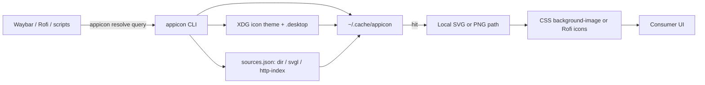

# Standalone appicon CLI + Waybar consumer

## Progress (2026-07-12)

**Repo:** [bolens/appicon](https://github.com/bolens/appicon) at `/home/panda/dev/appicon`. Local `main` is ahead of `origin` with the resolve implementation (not required to be pushed for this plan doc).

| Area | Status |
|------|--------|
| Scaffold + CI workflows + `make check` / `check-fast` | **Done** |
| XDG / `.desktop` (Flatpak + Snap roots, theme inheritance) | **Done** |
| Steam appid / `steam_icon_*` / `steam://rungameid/` | **Done** |
| SVGL cache-first + allowlist + stale catalog | **Done** |
| Local `dir` packs + `http-index` remotes via `sources.json` | **Done** |
| PNG raster (`resvg`/`rsvg-convert`/oksvg) + raster cache | **Done** |
| `--offline`, `cache prune`/`clear`/`stats`/`path` | **Done** |
| Overrides (`overrides.json`) + CLI `--json` e2e tests | **Done** |
| Tag **`v0.1.0`** + checksummed release assets | **Done** — [v0.1.0](https://github.com/bolens/appicon/releases/tag/v0.1.0) |
| waybar-config install + dock CSS proof | **Next** (other repo) |
| MCP server for agent tooling | Post-v1 |
| Completions/man, Nix/AUR/Home Manager, nightly live SVGL | Post-v1 |

**Packages shipped:** `cmd/appicon`, `internal/resolve`, `internal/xdg`, `internal/svgl`, `internal/pack`, `internal/httpindex`, `internal/cache`, `internal/raster`, `internal/version`.

**Tests:** fixture trees under `testdata/xdg` + `testdata/svgl`; httptest for SVGL/http-index; CLI e2e in `cmd/appicon`; behavioral resolve-order tests in `internal/resolve`. `make check` is the gate.

## Decision

Build **`bolens/appicon`** (new Go repo), **not** `waybar-appicon`. The CLI returns local icon paths — Waybar is the first consumer; the same binary serves Rofi, window-switcher, notifications, etc.

Go: static linux/amd64 + arm64 release binaries (same install pattern as this config’s CI tool downloads).

**Remote:** [bolens/appicon](https://github.com/bolens/appicon). Clone to `/home/panda/dev/appicon`; do not create a new GitHub repo.

## Architecture



**Resolve order (fixed):**

1. Existing file path
2. Freedesktop icon theme (via `.desktop` `Icon=` / name / class / Steam heuristics)
3. Configured logo sources in order (`sources.json`; default: SVGL only)
4. Miss → exit `1` / JSON `"path": null` (callers keep glyphs)

**Cache policy:** network never on hit. Catalog/index TTL ~7d; downloaded assets permanent until `appicon cache clear` or pruned. `--offline` = XDG + disk + local packs only. XDG hits return the theme file path directly (no copy); remote/pack assets live under `$XDG_CACHE_HOME/appicon/` (`svgs/`, `http/`, `raster/`).

## Gaps folded into v1 (previously missing)

| Gap | Plan | Status |
|-----|------|--------|
| **GTK/Waybar SVG CSS** | Default Waybar path: `resolve --format png --size 24`. | **Done** |
| **Size / theme** | `--size N`, `--theme dark\|light`, `APPICON_THEME` / icon-theme override. | **Done** |
| **Name mismatches** | `overrides.json` + small built-in aliases. | **Done** |
| **SSRF / safety** | SVGL hosts allowlisted; http-index requires per-source `hosts`. | **Done** |
| **Rate limits** | Cache-first; 429/5xx → stale catalog; ~2.5s timeout. | **Done** |
| **Atomic cache** | `.tmp` + rename; flock on catalog refresh. | **Done** |
| **License / brands** | MIT for code only; no logo packs in releases. | **Done** (docs) |
| **Install integrity** | Release `SHA256SUMS`; waybar install script verifies. | Pending release |
| **Flatpak / Snap** | Flatpak export dirs + `/var/lib/snapd/desktop`. | **Done** |
| **Steam** | appid / WM class / Exec `steam://rungameid/`. | **Done** |
| **Docs for agents** | `AGENTS.md` + `CONTRIBUTING.md`. | **Done** |

## CLI surface

| Command | Behavior | Status |
|---------|----------|--------|
| `appicon resolve <query>` | Print absolute path | **Done** |
| `appicon resolve --json` | Structured result (`source`, `theme`, `cached`, `format`, …) | **Done** |
| `appicon resolve --format png\|svg --size N --theme dark\|light` | Output format / variant | **Done** |
| `appicon resolve --offline` | No network | **Done** |
| `appicon prefetch <query>...` | Warm cache | **Done** |
| `appicon cache path\|clear\|stats\|prune` | Cache management | **Done** |
| `appicon version` | Semver from release ldflags | **Done** |

**Query inputs:** app id, WM class, `foo.desktop`, display name, Steam appid, or filesystem path.

**Config:**

- `$XDG_CONFIG_HOME/appicon/overrides.json` — query remaps
- `$XDG_CONFIG_HOME/appicon/sources.json` — ordered `svgl` / `dir` / `http-index`

## Tests and CI

**Local gates:** `make check-fast` (test + vet + gofmt), `make check` (+ golangci-lint when present, gitleaks, actionlint, markdownlint).

**Coverage in tree:** XDG fixtures (incl. Flatpak/Snap/Steam), SVGL httptest, http-index httptest, pack unit tests, resolve behavioral order, CLI e2e (`cmd/appicon`).

**GitHub Actions:** `ci.yml` on PR/push; `release.yml` on tag `v*` (amd64/arm64 + `SHA256SUMS`).

## Waybar-config consumer (after first release)

1. `scripts/infra/install-appicon.sh` — pin `APPICON_VERSION`, download + checksum verify → `~/.local/bin/appicon` (or `$WAYBAR_HOME/bin/`).
2. `make install-appicon` + README/scripts note.
3. Proof integration: dock launcher only — prefetch/resolve to PNG, generate CSS (`#custom-dock-* { background-image: url(...); }`), glyph fallback if binary missing or resolve fails.
4. Settings: `icons.appicon.enabled` / `theme` / `size` in waybar-settings; no-op when binary absent.

No SVGL URLs inside waybar scripts — only `appicon resolve`.

## Explicitly out of scope (deferred)

These stay **out of the product roadmap unless a concrete consumer forces them**. Notes below are enough to restart the design without rediscovering constraints.

### Daemon / socket

**Why deferred:** Waybar/Rofi/scripts already shell out per query; warm cache + ~ms XDG hits make a long-lived process unnecessary for the dock use case. A daemon adds lifecycle (systemd user unit), IPC versioning, and failure modes (stale socket, double instance) without changing the public “print a path” contract.

**If revisited:**

- Prefer a **user systemd** `appicon.socket` + `appicon.service` (socket activation), not a root daemon.
- Protocol: length-prefixed JSON request/response mirroring `resolve --json` fields (`query`, `format`, `size`, `theme`, `offline`) so CLI and socket share one resolver.
- Transport: `AF_UNIX` under `$XDG_RUNTIME_DIR/appicon.sock` (mode `0600`); reject abstract-namespace unless documented.
- Concurrency: single-flight per cache key for catalog refresh (existing flock); do not invent a second cache.
- Clients stay thin: `appicon resolve` can dial the socket when present and fall back to in-process resolve — never require the daemon.
- **Do not** put SVGL credentials or non-allowlisted downloads in the daemon; same security model as the CLI.

### Replacing tray SNI icons

**Why deferred:** StatusNotifierItem / KDE tray / AppIndicator icons are owned by the application process and compositor/panel. Swapping them means either LD_PRELOAD/hacks, a custom tray host, or patching each app — far outside “return a file path.”

**If revisited:**

- Scope as a **separate tool** (e.g. `appicon-trayd`) that only helps *our* panels (Waybar custom modules), not system-wide SNI replacement.
- Read icons for *display* via `appicon resolve` (PNG); never claim to be an SNI host unless implementing the full StatusNotifierWatcher/Item D-Bus APIs.
- Document that Electron/Chromium tray icons and proprietary indicators will remain opaque.

### Full logo catalogs vendored into release tarballs

**Why deferred:** Brand marks are third-party; shipping a logo pack in GitHub Releases creates redistribution / trademark / size problems and fights the “code only, MIT” stance. SVGL’s catalog is large and changes upstream.

**If revisited:**

- Prefer **user-cloned `dir` packs** (Simple Icons, dashboard-icons) or `http-index` with explicit hosts — already supported.
- Optional “offline bundle” would be a **separate artifact** (not the default `appicon_*_linux_*.tar.gz`), with its own license file and pin to an upstream commit SHA.
- Never merge a full catalog into `go:embed` or the main binary; keep releases tiny and static.

### `appicon self-update`

**Why deferred:** One more updater channel to secure (signature, rollback, partial downloads). We already plan checksummed GitHub releases + waybar `install-appicon.sh`, plus later Nix/AUR/Home Manager.

**Instead:**

- Re-run the install script / `make install-appicon` with a bumped pin.
- Or upgrade via package manager once AUR/Nix exist.
- If a self-update subcommand appears later: download release asset + `SHA256SUMS` (and cosign if enabled), verify, atomic replace under the same path as the running binary; refuse to update when installed via Nix/pacman (detect read-only store / package manager metadata).

### Perfect coverage for obscure apps

**Why deferred:** Infinite tail — proprietary WM classes, broken `.desktop` files, games without shortcuts, renamed Electron apps. Chasing 100% match rate balloons aliases and special cases.

**Instead:**

- Overrides file + Steam/Flatpak/Snap heuristics (done) cover the common miss classes.
- Users add `dir` packs / `http-index` / `overrides.json` for personal long-tail apps.
- Accept miss → exit `1` / glyph fallback as a **supported** outcome, not a bug.
- New heuristics only when a recurring miss shows up in a real consumer (e.g. waybar dock list), with a fixture test — no speculative alias dumps.

## Post-v1

Follow-ups after a tagged release + Waybar proof.

### Packaging / install

| Item | Notes |
|------|-------|
| **Nix flake** | `flake.nix`: package + `apps.appicon` for `nix run github:bolens/appicon` |
| **Home Manager** | `programs.appicon.enable` (pairs with flake) |
| **AUR** | Same tier as flake — optional beside GitHub release tarballs |
| **Release signing** | Optional cosign/sigstore in addition to `SHA256SUMS` |
| **Completions + man** | bash/zsh/fish completions; short man page |

### Pluggable logo sources

**Done:** `sources.json` with `svgl`, `dir`, `http-index` (per-source host allowlist).

**Docs:** clone Simple Icons / dashboard-icons locally; do not bake CDNs into the binary. Example dock-oriented order:

```text
path → XDG → dir packs (user) → svgl → miss
```

```json
{
  "sources": [
    { "type": "dir", "path": "~/.local/share/appicon/packs/dashboard-icons" },
    { "type": "dir", "path": "~/.local/share/appicon/packs/simple-icons/icons" },
    { "type": "svgl" },
    {
      "type": "http-index",
      "name": "my-cdn",
      "index": "https://icons.example/index.json",
      "hosts": ["icons.example"]
    }
  ]
}
```

**Do not promote:** Logo.dev / Brandfetch / Clearbit (API keys), Iconify (host/license surface), vendoring packs in releases.

### Extra consumers / CI

- Rofi / walker examples; notification helper notes — shell-out only
- Nightly or `workflow_dispatch` live SVGL smoke (1–2 titles); not required to merge

### MCP server (agent tooling)

**Why:** Coding agents (Cursor, Claude Code, etc.) already speak MCP. A thin server lets them resolve icons, prefetch, and inspect cache without inventing shell commands or embedding SVGL URLs.

**Placement:** live in this repo (e.g. `cmd/appicon-mcp` or `appicon mcp` subcommand) so one release ships CLI + MCP; consumers only need the binary on `PATH`.

**Transport:** stdio MCP (default for local agent configs). Optional later: same JSON tools over the deferred unix socket if a daemon exists.

**Tools (map 1:1 to CLI; no new resolve logic):**

| Tool | Mirrors | Notes |
|------|---------|-------|
| `resolve` | `appicon resolve --json` | args: `query`, optional `format`, `size`, `theme`, `offline`; returns path/source/cached/error |
| `prefetch` | `appicon prefetch` | args: `queries[]` |
| `cache_stats` | `appicon cache stats` | |
| `cache_clear` / `cache_prune` | matching subcommands | destructive — document clearly |
| `version` | `appicon version` | |

**Rules:**

- Call into `internal/resolve` (same as CLI) — **never** reimplement download/allowlist in the MCP layer.
- Still no SVGL URLs in agent prompts or other repos; agents call `resolve` only.
- Ship example Cursor/Claude MCP config snippet in README (`command`: `appicon`, `args`: `["mcp"]` or path to `appicon-mcp`).
- Tests: MCP tool unit tests with fixture XDG roots + injected clients (same pattern as CLI e2e); no live network required.

**Out of scope for the MCP:** browsing remote catalogs in-agent, writing `overrides.json` without an explicit tool, or exposing raw HTTP downloads.

## Execution order

1. ~~Clone + scaffold~~
2. ~~XDG resolve + fixtures~~
3. ~~Cache + SVGL + httptest + allowlist~~
4. ~~PNG output~~
5. ~~CI workflows + `make check`~~
6. ~~`--offline`, prune, packs, http-index, Steam, Snap~~
7. ~~Cut `v0.1.0` with checksums~~
8. waybar-config install + dock CSS proof ← current
9. (post-v1) MCP server for agents; completions/man; Nix / Home Manager / AUR; optional release signing
10. (post-v1) Extra consumers + nightly live SVGL job
